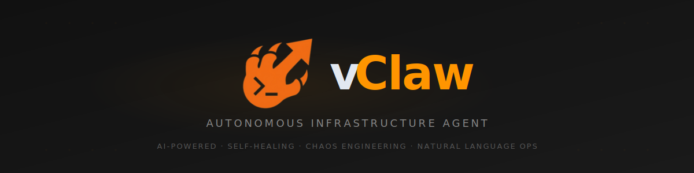
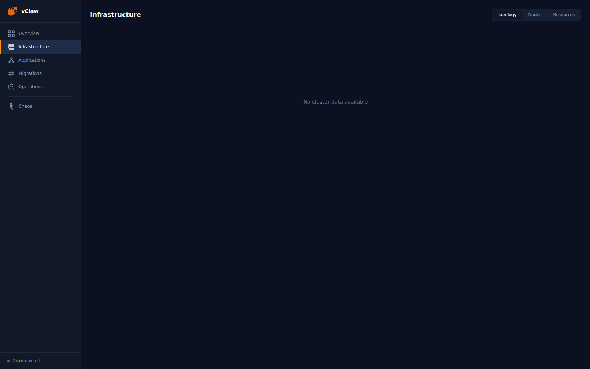

<p align="center">
  <picture>
    <source media="(prefers-color-scheme: dark)" srcset="docs/assets/banner.svg">
    <source media="(prefers-color-scheme: light)" srcset="docs/assets/banner.svg">
    
  </picture>
</p>

<p align="center">
  <strong>Autonomous AI agent for infrastructure management.<br/>One command. Any hypervisor. Full safety guardrails.</strong>
</p>

<p align="center">
  <a href="LICENSE"></a>
  
  
  
  
  
</p>

<p align="center">
  <a href="#quick-start">Quick Start</a> &bull;
  <a href="#how-it-works">How It Works</a> &bull;
  <a href="#features">Features</a> &bull;
  <a href="#architecture">Architecture</a> &bull;
  <a href="#security">Security</a> &bull;
  <a href="#contributing">Contributing</a>
</p>

---

## What is vClaw?

vClaw is an open-source AI agent that manages your entire infrastructure through natural language. Instead of switching between vCenter, Proxmox, AWS consoles, and half a dozen CLI tools, you describe what you want in plain English and vClaw figures out the rest.

It supports multiple hypervisors natively, classifies every action by risk level, and requires human approval before doing anything destructive. Built for IT teams, managed service providers, and homelabbers who are tired of juggling dashboards.

```bash
# Instead of this:
curl https://vcenter.local/api/vcenter/vm -X POST \
  -H "vmware-api-session-id: $SESSION" \
  -d '{"spec": {"name": "web-01", "cpu": {"cores": 4}, "memory": {"size_mib": 8192}}}'

# You do this:
vclaw "Create a web server VM with 4 cores and 8GB RAM on whichever host has the most capacity"
```

vClaw will analyze your infrastructure across all connected providers, generate an execution plan, run it through safety checks, execute with a full audit trail, and monitor the result.

---

## Why vClaw?

| Feature | vClaw | VMware Aria | Terraform | Kubiya | Ansible |
|---------|-------|-------------|-----------|--------|---------|
| **Multi-hypervisor** | Native (Proxmox + VMware) | VMware only | Via providers | Cloud only | Via modules |
| **Autonomous execution** | Yes | Recommendations only | Code generation | Yes | Playbook-based |
| **Natural language** | First-class | No | AI copilot | Yes | AI copilot |
| **Safety governance** | 5-tier + approval gates | Enterprise | Policy engine | Basic | Manual |
| **Open source** | MIT | Proprietary | BSL | Proprietary | GPL |
| **On-prem / homelab** | Yes | Yes | Yes | No | Yes |
| **Cost** | Free | $$$K/year | Free/paid | $$$/month | Free/paid |

No other tool combines multi-hypervisor support, autonomous execution, natural language control, and enterprise safety in a single open-source package.

---

## Quick Start

### Prerequisites

- Node.js 18+ (22+ recommended)
- Access to at least one infrastructure provider (Proxmox or VMware vSphere)
- An AI API key (Anthropic Claude, OpenAI, or compatible)

### Installation

```bash
git clone https://github.com/SherSystems/vclaw.git
cd vclaw
npm install
cp .env.example .env
```

### Configuration

Edit `.env` with your provider credentials:

```bash
# Proxmox
PROXMOX_HOST=192.168.1.10
PROXMOX_PORT=8006
PROXMOX_TOKEN_ID=root@pam!vclaw
PROXMOX_TOKEN_SECRET=your-token-secret

# VMware vSphere
VMWARE_HOST=vcenter.local
VMWARE_USER=administrator@vsphere.local
VMWARE_PASSWORD=your-password

# AI Provider
AI_PROVIDER=anthropic
AI_API_KEY=sk-ant-...
AI_MODEL=claude-sonnet-4-20250514
```

### Run

```bash
# Interactive CLI
npm run dev

# Web dashboard
npm run dashboard    # http://localhost:3000

# As an MCP server (Claude Desktop integration)
npm run dev:mcp
```

### Example Commands

```
> List all VMs across every provider
> Create a Ubuntu VM with 4 cores and 8GB RAM on the host with the most free memory
> Migrate db-replica-07 to a host with lower CPU load
> Show me all VMs using more than 90% CPU
> Take a snapshot of the production cluster before the upgrade
> Run chaos tests on staging and tell me what breaks
```

---

## How It Works

vClaw runs an autonomous agent loop:

```
  Describe          Plan            Govern          Execute         Observe
 ┌─────────┐    ┌──────────┐    ┌──────────┐    ┌──────────┐    ┌──────────┐
 │  User    │ -> │ AI plans │ -> │ 5-tier   │ -> │ Sandboxed│ -> │ Monitor  │
 │  request │    │ across   │    │ safety   │    │ execution│    │ & learn  │
 │  (NL)    │    │ providers│    │ checks   │    │ + audit  │    │ results  │
 └─────────┘    └──────────┘    └──────────┘    └──────────┘    └──────────┘
                                     │                               │
                                     v                               v
                              Human approval              Replan on failure
                              (if high-risk)              (self-healing)
```

1. **Describe**: Tell vClaw what you want in plain English.
2. **Plan**: The AI generates a step-by-step execution plan across all connected providers. It picks the right provider, host, and resource pool based on current state.
3. **Govern**: Every action is classified into one of 5 risk tiers. Low-risk operations (reads, tagging) run automatically. High-risk operations (migrations, deletions) require human approval.
4. **Execute**: Approved actions run in a sandboxed environment with timeouts, crash containment, and a full audit trail capturing before/after state.
5. **Observe**: vClaw monitors the result. If something fails, it investigates, diagnoses, and replans automatically.

---

## Features

### Multi-Provider Orchestration

Manage multiple infrastructure platforms from a single agent:

- **Proxmox VE**: 30+ tools covering VMs, containers, nodes, storage, snapshots, firewall rules, migrations, and cluster management
- **VMware vSphere**: 18+ tools for VMs, hosts, datastores, snapshots, guest operations, and resource pools
- **System**: SSH and local execution for package management, script execution, and configuration
- **Pluggable**: Provider abstraction layer makes it straightforward to add AWS, Azure, Kubernetes, or any other platform

### Enterprise Safety (NemoClaw-Inspired)

Security model inspired by [NVIDIA NemoClaw](https://github.com/NVIDIA/NeMo-Guardrails):

- **5-Tier Governance**: Every action classified by risk (read / safe_write / risky_write / destructive / never). Destructive operations are blocked without explicit human approval. Tier 4 (never) operations like formatting disks cannot be overridden.
- **Credential Vault**: Secrets encrypted at rest with AES-256-GCM, unique IV per operation, master key derived via scrypt. File permissions enforced at 0o600. Credentials are never sent to external APIs.
- **Privacy Router**: Infrastructure data (IPs, hostnames, topology) is redacted before LLM calls. Your infrastructure topology stays private.
- **Sandboxed Execution**: Every tool invocation runs in an isolated context with timeouts. Crashes are contained and cannot cascade to the agent core.
- **Circuit Breaker**: Stops execution after N consecutive failures to prevent cascading infrastructure damage.
- **Immutable Audit Trail**: Every action logged to SQLite with WAL journaling. Captures timestamp, user, action, provider, risk tier, approval status, and before/after state.

### Self-Healing

vClaw detects infrastructure anomalies and runs recovery playbooks automatically:

- VM crashes trigger instant restart with health verification
- Node failures initiate workload migration to healthy hosts
- Storage capacity alerts trigger automated cleanup
- Network latency spikes kick off automatic diagnostics
- All healing actions logged with full audit trail

### Chaos Engineering

Built-in fault injection for testing infrastructure resilience:

- Kill random VMs and measure recovery time
- Stress-test CPU, memory, disk, and network
- Trigger cascading failures to find weak points
- Generate before/after resilience reports

### Real-Time Dashboard

<p align="center">
  
</p>

Web-based dashboard with:
- Live topology map showing nodes, VMs, interconnects, and metrics
- Active execution plans with step-by-step progress
- Incident timeline and self-healing action log
- Resource utilization and forecasting
- Governance audit trail browser

### Multiple Interfaces

- **CLI**: Interactive terminal with command palette and rich output
- **Web Dashboard**: Real-time visualization, mobile-responsive
- **MCP Server**: Use vClaw directly inside Claude Desktop

Add to your Claude Desktop config:
```json
{
  "mcpServers": {
    "vclaw": {
      "command": "node",
      "args": ["dist/src/frontends/mcp.js"]
    }
  }
}
```

---

## Architecture

```
vClaw (14,000+ lines of TypeScript)
│
├── Agent Core
│   ├── AI Planner          Generates execution plans from natural language
│   ├── Executor            Runs steps through governance gates
│   ├── Observer            Monitors results, detects failures
│   ├── Investigator        Root cause analysis on failures
│   ├── Memory              Learns from past actions to improve future plans
│   ├── Healing Engine      Auto-remediation playbooks
│   └── Chaos Engine        Fault injection and resilience testing
│
├── Provider Layer (plugin architecture)
│   ├── Proxmox Adapter     30+ infrastructure tools
│   ├── VMware Adapter      18+ infrastructure tools
│   ├── System Adapter      SSH and local execution
│   └── [Planned]           AWS, Azure, Kubernetes
│
├── Security Layer (NemoClaw-inspired)
│   ├── Credential Vault    AES-256-GCM encrypted secrets
│   ├── Privacy Router      Redacts infra data before LLM calls
│   ├── Sandbox Manager     Isolated execution with timeouts
│   └── Audit Logger        Immutable SQLite audit trail
│
├── Governance Engine
│   ├── Action Classifier   5-tier risk classification
│   ├── Approval Gates      Human review for high-risk operations
│   └── Circuit Breaker     Stops after N consecutive failures
│
├── Monitoring
│   ├── Health Checks       Node status, VM state, storage capacity
│   ├── Anomaly Detection   Pattern-based anomaly identification
│   ├── Metric Store        Time-series infrastructure data
│   └── Event Stream        Real-time SSE to dashboard
│
└── Frontends
    ├── CLI                 Interactive terminal
    ├── Web Dashboard       React, real-time, mobile-responsive
    └── MCP Server          Claude Desktop integration
```

---

## Testing

907 tests across the entire codebase:

- **Agent core**: Planning, execution, observation, memory, replanning
- **Providers**: Proxmox and VMware tool coverage
- **Security**: Vault encryption/decryption, privacy router redaction, sandbox isolation, audit integrity
- **Governance**: Risk classification, approval gates, circuit breaker behavior
- **Edge cases**: 163 dedicated tests for boundary conditions, null handling, unicode, concurrent access, and error paths

```bash
npm test              # Run all 907 tests
npm run test:watch    # Watch mode for development
npm run test:coverage # Generate coverage report
```

---

## Roadmap

### Phase 1: Multi-Provider Foundation (current)
- [x] Proxmox VE provider (30+ tools)
- [x] VMware vSphere provider (18+ tools)
- [x] Multi-provider orchestration
- [x] NemoClaw-inspired security model
- [x] Self-healing and chaos engineering
- [x] Real-time web dashboard
- [x] MCP server for Claude Desktop
- [x] 907 passing tests

### Phase 2: Enterprise (Q2 2026)
- [ ] Kubernetes provider (EKS, AKS, GKE)
- [ ] AWS provider (EC2, RDS, S3, ELB)
- [ ] Multi-tenant support with RBAC
- [ ] SSO/SAML authentication
- [ ] Compliance exports (SOC 2, ISO 27001)

### Phase 3: Intelligence (Q3 2026)
- [ ] Local LLM inference on NVIDIA GPUs for air-gapped environments
- [ ] Predictive scaling based on historical workload patterns
- [ ] Automatic right-sizing and cost optimization
- [ ] Disaster recovery as code with auto-tested failover

### Phase 4: Ecosystem (Q4 2026)
- [ ] Community marketplace for provider adapters
- [ ] Terraform provider for managing vClaw via IaC
- [ ] REST API for programmatic access
- [ ] Mobile app (iOS/Android)

---

## Security

vClaw is built for environments where mistakes are expensive.

- **Zero trust**: Every action verified, nothing assumed safe by default
- **Credential isolation**: Secrets encrypted at rest, never sent to external APIs
- **LLM privacy**: Infrastructure data redacted before any API call
- **Audit immutability**: SQLite with WAL journaling for tamper-resistant logs
- **Sandboxed execution**: Tool crashes cannot cascade into agent failure
- **Governance by default**: Destructive operations always require human approval

See [SECURITY.md](SECURITY.md) for the full security policy, threat model, and vulnerability reporting process.

---

## Contributing

We welcome contributions. See [CONTRIBUTING.md](CONTRIBUTING.md) for guidelines.

The short version:
- Fork, branch, test, PR
- Every feature needs tests
- Every bug fix needs a regression test
- Open a Discussion before proposing large changes

### Adding a Provider

vClaw uses a plugin architecture. Implement the `InfraAdapter` interface, register your provider, write tests, and open a PR. See the Proxmox and VMware adapters for reference.

---

## License

[MIT](LICENSE). Free to use, modify, and distribute. No restrictions.

---

## Credits

Built by [Sher Systems](https://shersystems.com).

Inspired by:
- [NVIDIA NemoClaw](https://github.com/NVIDIA/NeMo-Guardrails) (security model)
- [HashiCorp Terraform](https://github.com/hashicorp/terraform) (provider abstraction)
- [Kubernetes](https://github.com/kubernetes/kubernetes) (operator pattern)

---

<p align="center">
  <a href="https://shersystems.com">Website</a> &bull;
  <a href="https://github.com/SherSystems/vclaw/issues">Issues</a> &bull;
  <a href="https://github.com/SherSystems/vclaw/discussions">Discussions</a> &bull;
  <a href="https://twitter.com/shersystems">Twitter</a>
</p>
