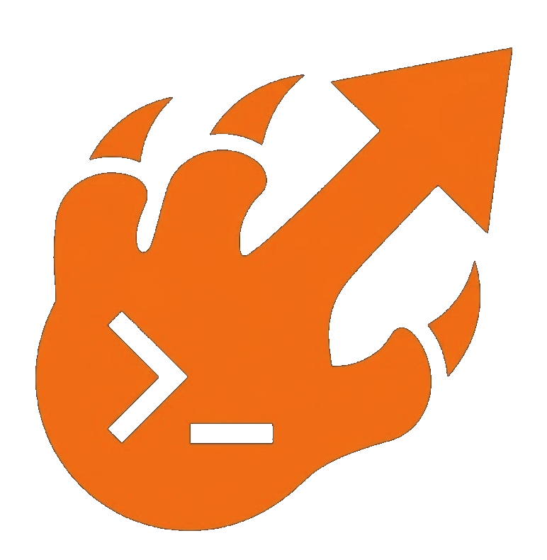

<p align="center">
  
</p>

<h1 align="center">RHODES</h1>

<p align="center">
  <strong>Reasoning, Hybrid Orchestration, Deployment &amp; Execution System.<br/>Infrastructure, executed.</strong>
</p>

<p align="center">
  <a href="LICENSE"></a>
  
  
  
  
  
</p>

<p align="center">
  <a href="#quick-start">Quick Start</a> &bull;
  <a href="#documentation">Documentation</a> &bull;
  <a href="#how-it-works">How It Works</a> &bull;
  <a href="#features">Features</a> &bull;
  <a href="#architecture">Architecture</a> &bull;
  <a href="#security">Security</a> &bull;
  <a href="#contributing">Contributing</a>
</p>

---

## What is RHODES?

RHODES is an agentic infrastructure operations platform. State your intent in plain language. RHODES builds an inspectable execution plan, validates dependencies and provider state, and executes across vCenter, Proxmox, Kubernetes, AWS, and bare metal.

It treats infrastructure operations like a reasoning problem. Plans are inspectable. Execution is grounded in real system state. Providers become composable substrates instead of isolated silos. Operators stay in control.

```bash
# Instead of this:
curl https://vcenter.local/api/vcenter/vm -X POST \
  -H "vmware-api-session-id: $SESSION" \
  -d '{"spec": {"name": "web-01", "cpu": {"cores": 4}, "memory": {"size_mib": 8192}}}'

# You do this:
rhodes "Provision a web server VM with 4 cores and 8 GB RAM on the host with the most free capacity"
```

RHODES inspects runtime state across connected providers, builds an execution plan, validates dependencies, executes through approval gates, and tracks drift.

---

## Positioning

| Capability | RHODES | VMware Aria | Terraform | Ansible |
|---|---|---|---|---|
| **Hybrid substrate orchestration** | Native (Proxmox + VMware + Azure + AWS) | VMware only | Via providers | Via modules |
| **Agentic execution** | Yes | Recommendations only | Code generation | Playbook-based |
| **Plain-language intent** | First-class | No | AI copilot | AI copilot |
| **Plan-before-execute** | Inspectable plans + approval gates | Enterprise | `terraform plan` | `--check` mode |
| **Drift detection / reconcile** | Built-in | Yes | Yes | Limited |
| **License** | MIT | Proprietary | BSL | GPL |

RHODES composes infrastructure. It does not replace it.

---

## Quick Start

### Prerequisites

- Node.js 18+ (22+ recommended)
- Access to at least one infrastructure provider (Proxmox, VMware vSphere, Azure, or AWS)
- An AI API key (Anthropic Claude, OpenAI, or compatible)

### Installation

```bash
git clone https://github.com/SherSystems/rhodes.git
cd rhodes
npm install
cp .env.example .env
```

### Configuration

Edit `.env` with your provider credentials:

```bash
# Proxmox
PROXMOX_HOST=192.168.1.10
PROXMOX_PORT=8006
PROXMOX_TOKEN_ID=root@pam!rhodes
PROXMOX_TOKEN_SECRET=your-token-secret

# VMware vSphere
VMWARE_HOST=vcenter.local
VMWARE_USER=administrator@vsphere.local
VMWARE_PASSWORD=your-password

# Azure
AZURE_TENANT_ID=your-tenant-id
AZURE_CLIENT_ID=your-app-client-id
AZURE_CLIENT_SECRET=your-client-secret
AZURE_SUBSCRIPTION_ID=your-subscription-id
AZURE_DEFAULT_LOCATION=eastus

# System Adapter SSH policy (secure-by-default)
SYSTEM_SSH_STRICT_HOST_KEY_CHECK=true

# AI Provider
AI_PROVIDER=anthropic
AI_API_KEY=sk-ant-...
AI_MODEL=claude-sonnet-4-20250514
```

### Run

```bash
# Interactive CLI (alias: rho)
rhodes

# Web dashboard
rhodes dashboard       # http://localhost:3000

# MCP server (Claude Desktop integration)
rhodes mcp

# Autopilot daemon + dashboard
rhodes autopilot
```

### Example Operations

```
rhodes@mission:~$ List all VMs across every provider
rhodes@mission:~$ Provision a Ubuntu VM with 4 cores and 8 GB RAM on the host with the most free memory
rhodes@mission:~$ Migrate db-replica-07 to a host with lower CPU load
rhodes@mission:~$ Reconcile drift in the production workspace
rhodes@mission:~$ Snapshot the production cluster before the upgrade
```

---

## Documentation

- [Quickstart Guide](docs/quickstart.md) (Proxmox + VMware + Azure + AWS setup paths, migration execution prerequisites, governance walkthrough)
- [Architecture Guide](docs/architecture.md) (core system design, adapter model, governance, and extension points)
- [Provider Guides Index](docs/providers/README.md) (Azure, Proxmox, VMware, AWS, Kubernetes scaffold)
- [Azure Provider Guide](docs/providers/azure.md) (reference template for provider docs)
- [Proxmox Provider Guide](docs/providers/proxmox.md) (31 tools across VM/CT lifecycle, storage, tasks, and firewall)
- [VMware Provider Guide](docs/providers/vmware.md) (26 tools with explicit REST vs SOAP caveats)
- [AWS Provider Guide](docs/providers/aws.md) (16 tools for EC2, EBS, VPC, AMI workflows)
- [Kubernetes Provider Guide](docs/providers/kubernetes.md) (current scaffold behavior and planned integration points)
- [Provider Authoring Guide](docs/provider-authoring-guide.md) (implementing and registering new adapters)
- [CHANGELOG](CHANGELOG.md)

---

## How It Works

RHODES runs an agentic operations loop:

```
   Intent          Plan            Govern          Execute         Reconcile
 ┌─────────┐    ┌──────────┐    ┌──────────┐    ┌──────────┐    ┌──────────┐
 │  User   │ -> │ Plan     │ -> │ Risk     │ -> │ Provider │ -> │ Detect   │
 │  states │    │ across   │    │ tiering  │    │ execution│    │ drift &  │
 │  intent │    │ providers│    │ + gates  │    │ + audit  │    │ reconcile│
 └─────────┘    └──────────┘    └──────────┘    └──────────┘    └──────────┘
                                     │                               │
                                     v                               v
                              Approval gate                  Replan on failure
```

1. **Intent**: State the desired outcome in plain language.
2. **Plan**: RHODES builds an inspectable execution plan grounded in current provider state.
3. **Govern**: Every step is classified into one of 5 risk tiers. Reads run automatically. Destructive operations require explicit approval.
4. **Execute**: Approved steps run through a sandboxed executor with timeouts, before/after state capture, and a full audit trail.
5. **Reconcile**: RHODES tracks drift and proposes remediation plans for changes that fall outside intended state.

---

## Features

### Hybrid Provider Orchestration

Operate across substrates without rewriting your stack:

- **Proxmox VE**: 30+ tools covering VMs, containers, nodes, storage, snapshots, firewall rules, migrations, and cluster management
- **VMware vSphere**: 26 tools for VMs, hosts, datastores, guest operations, resource pools, and snapshots
- **Azure**: 16 tools across ARM Compute, Network, and Resources (VMs, disks, vnets, subnets, NSGs, images)
- **AWS**: 16 tools across EC2 lifecycle, EBS snapshots, AMI workflows, VPCs, subnets, and security groups
- **System**: SSH and local execution for package management, scripts, and configuration
- **Kubernetes (scaffold)**: `ProviderAdapter` skeleton with documented planned `kubectl`/API integration points
- **Cross-Provider Migration**: Migration flows across VMware, Proxmox, AWS, and Azure
- **Pluggable**: Provider abstraction layer to add additional substrates

### Plan Before Execution

- Generate multi-step operational plans
- Validate dependencies and provider state
- Review changes before execution
- Approval gates for destructive operations

### Coordinate Across Substrates

- Connect vCenter, Proxmox, Kubernetes, AWS, and bare metal
- Normalize operational workflows
- Reduce provider-specific overhead

### Drift Detection and Recovery

Infrastructure changes. RHODES tracks and reconciles it.

- Detect configuration drift across environments
- Generate remediation plans automatically
- Execute targeted fixes with approval gates

### Governance and Safety

- **5-Tier Risk Classification**: read / safe_write / risky_write / destructive / never. Tier 4 operations cannot be overridden.
- **Credential Vault**: AES-256-GCM at rest, unique IV per operation, master key derived via scrypt, file permissions enforced at 0o600. Credentials are never sent to external APIs.
- **Privacy Router**: Infrastructure data (IPs, hostnames, topology) is redacted before LLM calls.
- **Sandboxed Execution**: Tool invocations run in isolated contexts with timeouts. Crashes cannot cascade.
- **Circuit Breaker**: Halts execution after N consecutive failures.
- **Immutable Audit Trail**: SQLite with WAL journaling captures timestamp, action, provider, tier, approval status, and before/after state.

### Cross-Provider VM Migration

- **VMware → Proxmox**: Export VM config, SCP VMDK, convert to QCOW2, create target VM, boot
- **Proxmox → VMware**: Export QCOW2, convert to VMDK, import to ESXi via `vim-cmd`, register with vCenter
- **Proxmox → Azure**: Export disk, convert to raw, stream upload to Azure page blob, import managed disk, create VM, rollback cleanup on failure
- **Cloud uploader architecture**: Stream disks over SSH from source host through RHODES into AWS S3 / Azure page blobs (no source-host cloud CLI required)
- **AWS import acceleration**: ImportSnapshot-first path for raw disks, RegisterImage with HVM/ENA/UEFI-preferred defaults, tuned multipart upload, ImportImage fallback retained

### Runtime Surfaces

- **CLI**: Interactive REPL with rich plan formatting and slash commands
- **Dashboard**: Real-time visualization of plans, runtime state, providers, and audit log
- **MCP Server**: Use RHODES directly inside Claude Desktop

Add to your Claude Desktop config:
```json
{
  "mcpServers": {
    "rhodes": {
      "command": "node",
      "args": ["dist/src/frontends/mcp.js"]
    }
  }
}
```

---

## Architecture

```
RHODES (14,000+ lines of TypeScript)
│
├── Agent Core
│   ├── Planner            Builds execution plans from natural language intent
│   ├── Executor           Runs steps through governance gates
│   ├── Observer           Monitors results, detects failures
│   ├── Investigator       Root cause analysis on failures
│   ├── Memory             Learns from past runs to improve future plans
│   ├── Healing Engine     Reconciliation playbooks
│   └── Chaos Engine       Fault injection for resilience testing
│
├── Migration Engine
│   ├── VMware Exporter    Extract VMs from vSphere
│   ├── VMware Importer    Create VMs on ESXi
│   ├── Proxmox Exporter   Extract VMs from Proxmox
│   ├── Proxmox Importer   Create VMs on Proxmox
│   ├── Disk Converter     VMDK ↔ QCOW2 conversion
│   └── Orchestrator       End-to-end migration pipeline
│
├── Provider Layer (plugin architecture)
│   ├── Proxmox Adapter    30+ tools
│   ├── VMware Adapter     27 tools
│   ├── Azure Adapter      17 tools
│   ├── AWS Adapter        16 tools
│   ├── System Adapter     SSH and local execution
│   └── Kubernetes Adapter Scaffold (state + integration call map)
│
├── Security Layer
│   ├── Credential Vault   AES-256-GCM encrypted secrets
│   ├── Privacy Router     Redacts infrastructure data before LLM calls
│   ├── Sandbox Manager    Isolated execution with timeouts
│   └── Audit Logger       Immutable SQLite audit trail
│
├── Governance Engine
│   ├── Action Classifier  5-tier risk classification
│   ├── Approval Gates     Human review for high-risk operations
│   └── Circuit Breaker    Halts after N consecutive failures
│
├── Monitoring
│   ├── Health Checks      Node status, VM state, storage capacity
│   ├── Anomaly Detection  Pattern-based detection
│   ├── Metric Store       Time-series infrastructure data
│   └── Event Stream       Real-time SSE to dashboard
│
└── Frontends
    ├── CLI                Interactive REPL with rich plan tables
    ├── Web Dashboard      Live plans, runtime, providers, audit
    └── MCP Server         Claude Desktop integration
```

---

## Testing

```bash
npm test              # Run full suite
npm run test:watch    # Watch mode for development
npm run test:coverage # Generate coverage report
npm run typecheck     # Type-check without emit
```

Coverage spans agent core (planning, execution, observation, memory, replanning), provider adapters, migration paths (export, conversion, upload, import), security (vault, privacy router, sandbox, audit), and governance (classification, gates, circuit breaker).

---

## Roadmap

### Phase 1: Hybrid Substrate Foundation (current)
- [x] Proxmox VE provider (30+ tools)
- [x] VMware vSphere provider (27 tools)
- [x] Azure provider (ARM Compute, Network, Resources)
- [x] AWS provider (EC2, EBS, AMI, VPC, security groups)
- [x] Cross-provider migration (VMware, Proxmox, AWS, Azure flows)
- [x] Cloud uploader for S3 / Azure page blobs without source-host CLIs
- [x] 5-tier governance with approval gates
- [x] Reconciliation and chaos engineering engines
- [x] MCP server for Claude Desktop

### Phase 2: Enterprise
- [ ] Kubernetes provider (EKS, AKS, GKE)
- [ ] Expanded AWS surface (RDS, S3, ELB)
- [ ] Multi-tenant workspaces with RBAC
- [ ] SSO / SAML
- [ ] Compliance exports (SOC 2, ISO 27001)

### Phase 3: Intelligence
- [ ] On-prem LLM inference for air-gapped environments
- [ ] Predictive scaling from historical workload patterns
- [ ] Automated right-sizing and cost reconciliation
- [ ] Disaster recovery as code with tested failover

### Phase 4: Ecosystem
- [ ] Community marketplace for provider adapters
- [ ] Terraform provider for RHODES IaC
- [ ] REST API for programmatic access

---

## Security

RHODES is built for environments where mistakes are expensive.

- **Zero trust**: Every action verified, nothing assumed safe by default
- **Credential isolation**: Secrets encrypted at rest, never sent to external APIs
- **LLM privacy**: Infrastructure data redacted before any API call
- **Audit immutability**: SQLite with WAL journaling for tamper-resistant logs
- **Sandboxed execution**: Tool crashes cannot cascade into agent failure
- **Governance by default**: Destructive operations always require explicit approval

See [SECURITY.md](SECURITY.md) for the full security policy, threat model, and vulnerability reporting process.

---

## Contributing

Contributions welcome. See [CONTRIBUTING.md](CONTRIBUTING.md) for guidelines.

- Fork, branch, test, PR
- Every feature needs tests
- Every bug fix needs a regression test
- Open a Discussion before proposing large changes
- For adapter development, start with [docs/provider-authoring-guide.md](docs/provider-authoring-guide.md)

### Adding a Provider

RHODES uses a plugin architecture. Implement the `InfraAdapter` interface, register your provider, write tests, and open a PR. See the Proxmox and VMware adapters for reference.

---

## License

[MIT](LICENSE). Free to use, modify, and distribute. No restrictions.

---

## Credits

Built by [Sher Systems](https://shersystems.com).

- NVIDIA Inception Member
- SAM.gov Registered

---

<p align="center">
  <strong>Infrastructure, executed.</strong><br/>
  <em>Reason. Coordinate. Execute.</em>
</p>

<p align="center">
  <a href="https://shersystems.com">Website</a> &bull;
  <a href="https://github.com/SherSystems/rhodes/issues">Issues</a> &bull;
  <a href="https://github.com/SherSystems/rhodes/discussions">Discussions</a>
</p>
