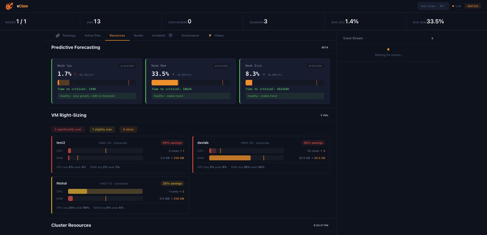

<p align="center">
  <picture>
    <source media="(prefers-color-scheme: dark)" srcset="docs/assets/banner.svg">
    <source media="(prefers-color-scheme: light)" srcset="docs/assets/banner.svg">
    
  </picture>
</p>

<p align="center">
  <strong>An autonomous AI agent that plans, deploys, monitors, heals, and stress-tests your infrastructure — any hypervisor, any provider.</strong>
</p>

<p align="center">
  
  
  
  
  
  
</p>

<br/>

<p align="center"><em>Built by <a href="https://github.com/patelpa1639">Pranav Patel</a> with help from Claude and Codex.</em></p>

## Why vClaw?

Modern infrastructure tools make you choose: **observability** OR **automation** OR **chaos testing**. vClaw is all three in one autonomous agent. Describe what you want in plain English, and it plans, executes, monitors, self-heals, and resilience-tests your infrastructure — with governance guardrails at every step.

> Think of it as **vRealize / Aria Operations** meets **ChatGPT** meets **Chaos Monkey** — but open source, multi-provider, running on your own hardware.

### Multi-Provider by Design

vClaw isn't locked to one hypervisor. The provider abstraction layer lets you manage Proxmox, VMware vSphere, and future providers (AWS, Azure, Kubernetes) through the same agent, same dashboard, same governance model.

---

## Screenshots

<p align="center">
  
  <br/><em>Interactive topology map — nodes, VMs, and storage with live metrics</em>
</p>

<p align="center">
  
  <br/><em>Predictive forecasting, VM right-sizing recommendations, and cluster resource gauges</em>
</p>

<p align="center">
  
  <br/><em>Cmd+K command palette — natural language infrastructure control</em>
</p>

<p align="center">
  
  <br/><em>Chaos engineering — simulate and execute failure scenarios with resilience scoring</em>
</p>

---

## Features

### Multi-Provider Infrastructure Management
Manage Proxmox VE and VMware vSphere clusters through a single agent. The provider abstraction layer normalizes nodes, VMs, containers, and storage into a unified model — add new providers by implementing one interface.

### AI-Powered Natural Language Ops
Describe goals in plain English ("create an Ubuntu VM with 4 cores and 8GB RAM"). The agent generates a dependency-aware execution plan, runs it step-by-step, observes results, and replans on failure.

### Self-Healing Orchestrator
Continuous background monitoring detects anomalies via threshold, trend, spike, and flatline analysis. When something breaks, it matches a playbook, executes remediation, verifies recovery, and resolves the incident — all without human intervention.

### AI Root Cause Analysis
When incidents fire, the LLM analyzes 30 minutes of metrics and recent events to explain *why* the failure happened, not just *what* failed. RCA results stream live to the dashboard.

### Chaos Engineering
Built-in chaos scenarios (VM Kill, Random VM Kill, Multi-VM Kill, Node Drain) with blast radius simulation, predicted vs. actual recovery comparison, and resilience scoring. Test your self-healing before production surprises you.

### Command Palette (Cmd+K)
Spotlight-style overlay for natural language infrastructure control. Type what you want, hit enter — the agent handles the rest.

### Five-Tier Governance
Every action is classified by risk (`read` / `safe_write` / `risky_write` / `destructive` / `never`). YAML policy-driven guardrails, circuit breakers, and a persistent SQLite audit trail ensure nothing dangerous happens without approval.

### Multi-Frontend Access
Control your infrastructure from the **web dashboard** (HTTP + SSE), **Telegram bot** (with inline approval buttons), **interactive CLI**, or **MCP server** (for Claude Code integration).

---

## Architecture

```
                         +-----------+
                         |   User    |
                         +-----+-----+
                               |
              +----------------+----------------+
              |                |                |
        +-----------+   +-----------+   +-----------+
        | Telegram  |   |    CLI    |   | Dashboard |
        |   Bot     |   |   REPL    |   | (HTTP+SSE)|
        +-----------+   +-----------+   +-----------+
              |                |                |
              +----------------+----------------+
                               |
                       +-------+-------+
                       |  Agent Core   |
                       |  plan / exec  |
                       |  observe /    |
                       |  replan       |
                       +---+---+---+---+
                           |   |   |
              +------------+   |   +------------+
              |                |                |
        +-----------+   +-----------+   +-----------+
        |  Planner  |   | Executor  |   | Observer  |
        | (LLM)     |   |(run tools)|   | (verify)  |
        +-----------+   +-----------+   +-----------+
                               |
                       +-------+-------+
                       | Tool Registry |
                       +---+---+---+---+
                           |   |   |
                    +------+ +-+--+ +------+
                    |Proxmox| |VMware| |System|
                    |  API  | | API  | |Tools |
                    +-------+ +------+ +------+

  +-----------------+    +-------------------+    +--------------+
  |   Governance    |    |     Healing       |    |  Chaos       |
  | - Classifier    |    |  Orchestrator     |    |  Engine      |
  | - Approval Gate |<-->| - Health Monitor  |<-->| - Simulate   |
  | - Circuit Break |    | - Anomaly Detect  |    | - Execute    |
  | - Audit Log     |    | - Playbook Engine |    | - Score      |
  +-----------------+    | - AI Root Cause   |    +--------------+
                         +-------------------+
```

---

## Quick Start

### Prerequisites

- Node.js 22+ (18+ minimum)
- Access to a Proxmox VE and/or VMware vSphere instance
- Anthropic API key
- Telegram bot token (optional, for mobile access)

### Install

```bash
git clone https://github.com/patelpa1639/vclaw.git
cd vclaw
npm install
```

### Configure

```bash
cp .env.example .env
```

Edit `.env` with your configuration:

```env
# Proxmox VE
PROXMOX_HOST=192.168.1.100
PROXMOX_PORT=8006
PROXMOX_TOKEN_ID=user@realm!tokenname
PROXMOX_TOKEN_SECRET=<your-token-secret>

# VMware vSphere (optional)
VMWARE_HOST=vcenter.lab.local
VMWARE_USER=administrator@vsphere.local
VMWARE_PASSWORD=<your-password>
VMWARE_INSECURE=true

# AI / LLM
AI_PROVIDER=anthropic
AI_API_KEY=<your-anthropic-api-key>
AI_MODEL=claude-haiku-4-5-20251001

# Telegram (optional)
TELEGRAM_BOT_TOKEN=<your-bot-token>
TELEGRAM_ALLOWED_USERS=<comma-separated-user-ids>

# Dashboard
DASHBOARD_PORT=3000
```

### Run

```bash
# Full mode — dashboard + telegram + self-healing + autopilot
npm run dev -- full

# Dev mode — CLI + dashboard + telegram + self-healing (best for testing)
npm run dev -- dev

# Interactive CLI only
npm run dev -- cli

# One-shot command
npm run dev -- "create a Ubuntu VM with 2 cores and 4GB RAM"

# Dashboard only
npm run dev -- dashboard

# MCP server (for Claude Code integration)
npm run dev -- mcp
```

---

## Governance

Every action is classified by risk and subject to policy controls.

| Tier | Examples | Approval |
|------|----------|----------|
| `read` | List VMs, check status, read logs | Never needed |
| `safe_write` | Start VM, create snapshot | Auto in watch mode |
| `risky_write` | Create VM, modify config, stop VM | Required in build mode |
| `destructive` | Delete VM, delete snapshot, force operations | Always requires explicit confirmation |
| `never` | `delete_all`, `format_storage`, `wipe*` | Agent refuses unconditionally |

---

## Provider Architecture

vClaw uses a pluggable provider pattern. Each provider implements the `InfraAdapter` interface:

```typescript
interface InfraAdapter {
  name: string;
  connect(): Promise<void>;
  disconnect(): Promise<void>;
  isConnected(): boolean;
  getTools(): ToolDefinition[];
  execute(tool: string, params: Record<string, unknown>): Promise<ToolCallResult>;
  getClusterState(): Promise<ClusterState>;
}
```

The `ToolRegistry` routes tool execution to the correct provider. Tools are registered with risk tiers so governance applies uniformly across all providers.

| Provider | Status | Tools |
|----------|--------|-------|
| Proxmox VE | Stable | 30+ (VMs, containers, snapshots, storage, migration, firewall) |
| VMware vSphere | In Progress | VM lifecycle, host management, datastore ops |
| System | Stable | SSH, local exec, ping, package install, service config |

---

## Tech Stack

| Component | Technology |
|---|---|
| Language | TypeScript (strict mode) |
| Runtime | Node.js 22 |
| AI / LLM | Anthropic Claude (Haiku for cost-efficiency) |
| Infrastructure APIs | Proxmox VE REST, VMware vSphere REST |
| Telegram | grammY |
| Real-Time Streaming | Server-Sent Events (SSE) |
| Audit Storage | SQLite via better-sqlite3 |
| Schema Validation | Zod |
| MCP Integration | Model Context Protocol SDK |
| Dashboard | React 19 + Vite 6 + Zustand |
| Testing | Vitest |

---

## Project Structure

```
vclaw/
├── src/
│   ├── index.ts              # Entry point — mode router
│   ├── config.ts             # Environment config loader (Zod validated)
│   ├── types.ts              # Shared type definitions
│   ├── providers/
│   │   ├── types.ts          # InfraAdapter interface + shared types
│   │   ├── registry.ts       # Tool registry + multi-provider routing
│   │   ├── proxmox/          # Proxmox VE adapter + REST client
│   │   └── system/           # System tools (SSH, exec, ping)
│   ├── agent/
│   │   ├── core.ts           # Plan → Execute → Observe → Replan loop
│   │   ├── planner.ts        # LLM-powered plan generation
│   │   ├── executor.ts       # Step execution with governance checks
│   │   ├── observer.ts       # Post-condition verification
│   │   ├── investigator.ts   # Root cause analysis engine
│   │   ├── memory.ts         # Pattern + failure memory (SQLite)
│   │   ├── events.ts         # EventBus (pub/sub + history ring buffer)
│   │   ├── llm.ts            # LLM abstraction (Anthropic / OpenAI)
│   │   └── prompts.ts        # System prompts for each agent role
│   ├── governance/           # Policy, classification, approval, audit, circuit breaker
│   ├── healing/              # Incident management, playbooks, healing orchestrator
│   ├── monitoring/           # Health metrics, anomaly detection
│   ├── chaos/                # Chaos engineering — simulate, execute, score
│   ├── autopilot/            # Background polling daemon + rules
│   └── frontends/            # CLI, Telegram, MCP, Dashboard server
├── dashboard/                # React 19 frontend (Vite + Zustand)
├── tests/                    # Vitest test suite (486 tests)
├── policies/default.yaml     # Default governance policy
├── .env.example              # Configuration template
└── vclaw.service             # Systemd service file
```

---

## Roadmap

- [x] Provider abstraction layer
- [x] Proxmox VE adapter (30+ tools)
- [x] System adapter (SSH, exec, ping, scripts)
- [ ] VMware vSphere adapter
- [ ] NemoClaw-inspired security (credential vault, sandbox isolation, privacy router)
- [ ] Multi-provider agent loop (cross-provider orchestration)
- [ ] AWS / Azure / Kubernetes adapters
- [ ] Persistent dashboard metrics (Prometheus / InfluxDB export)
- [ ] Webhook integrations (Slack, PagerDuty, Discord)
- [ ] Custom playbook authoring via YAML
- [ ] Role-based access control

---

## License

MIT

---

<p align="center">
  
  <br/><br/>
  Built by <a href="https://github.com/patelpa1639">Pranav Patel</a>
</p>
