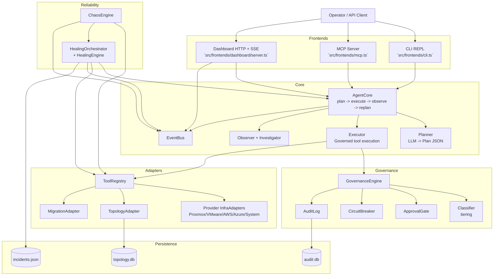

# vClaw Architecture Guide

This guide explains how vClaw is wired end to end, with a focus on adding a new provider adapter safely.

Canonical implementation sources:

- `src/index.ts`
- `src/providers/types.ts`
- `src/providers/registry.ts`
- `src/agent/core.ts`
- `src/agent/planner.ts`
- `src/agent/executor.ts`
- `src/governance/index.ts`
- `src/migration/adapter.ts`
- `src/topology/adapter.ts`
- `src/healing/orchestrator.ts`
- `src/chaos/engine.ts`
- `src/frontends/dashboard/server.ts`

## 1. Top-down architecture

## 2. Startup and composition

`src/index.ts` is the composition root.

At startup it:

1. Loads env config (`src/config.ts`) and policy (`policies/default.yaml` via `src/governance/policy.ts`).
2. Creates shared services: `EventBus`, `RunTelemetryCollector`, `GovernanceEngine`, `ToolRegistry`.
3. Conditionally registers provider adapters based on configured credentials.
4. Registers `SystemAdapter` and `TopologyAdapter`.
5. Optionally constructs `MigrationAdapter` when migration prerequisites are available.
6. Connects adapters (`registry.connectAll()`).
7. Creates `AgentCore` with planner/executor/observer/memory/orchestrator.
8. Boots frontend mode (`cli`, `dashboard`, `mcp`, `autopilot`, `dev`, or `full`).

Design consequence: almost everything is dependency-injected once at process start, so new subsystems should plug in here.

## 3. InfraAdapter pattern and ToolRegistry

The provider contract is `InfraAdapter` in `src/providers/types.ts`:

- `connect()` / `disconnect()` / `isConnected()`
- `getTools(): ToolDefinition[]`
- `execute(tool, params)`
- `getClusterState()`

Every action exposed to the planner is a `ToolDefinition` with:

- globally unique tool name
- adapter name
- risk tier (`read | safe_write | risky_write | destructive | never`)
- parameter schema and return summary

`ToolRegistry` (`src/providers/registry.ts`) is the runtime switchboard:

- stores adapters and flattened tool catalog
- routes `execute(toolName, params)` to owning adapter
- provides single-provider and multi-provider cluster views
- emits LLM-ready tool descriptions for planning

This is the key extensibility seam: new providers only need to implement `InfraAdapter` and register once.

## 4. Request lifecycle (plan -> govern -> execute -> observe)

`AgentCore.run()` (`src/agent/core.ts`) handles a goal as a deterministic loop:

1. Collect context (`getClusterState`, `getMultiClusterState`, memory).
2. Plan with `Planner` (`src/agent/planner.ts`) via LLM prompt + JSON validation.
3. Emit `plan_created` on `EventBus`.
4. Optionally request plan-level approval.
5. Execute ready steps via `Executor` in dependency order.
6. Observe results and trigger replan on failure paths.
7. Emit run completion metrics/events.

`Executor` (`src/agent/executor.ts`) adds hard controls around each step:

- governance decision before execution
- optional explicit approval enforcement
- timeout handling
- before/after state capture
- audit logging and rollback trigger signals

## 5. Five-tier safety governance

Governance is centralized in `GovernanceEngine.evaluate()` (`src/governance/index.ts`):

1. Circuit breaker gate.
2. Tier classification (`src/governance/classifier.ts`).
3. Forbidden checks (`never` tier + policy forbidden actions).
4. Guardrail checks (VM count, network/storage boundaries, VMID restrictions).
5. Approval decision via `ApprovalGate`.

Tier model:

- `read`: non-mutating
- `safe_write`: low-risk mutation
- `risky_write`: higher blast radius
- `destructive`: irreversible/high-impact
- `never`: blocked, not approvable

Default orchestration policy behavior (`src/governance/policy.ts`):

- explicit approval tiers default to `destructive` and `never`
- rollback triggers default on `risky_write` and `destructive`

## 6. Cross-provider migration subsystem

`MigrationAdapter` (`src/migration/adapter.ts`) exposes migration tools through the same adapter/tool model.

Key points:

- dry-run planning tools (`plan_migration_*`) are `read`
- execution tools (`migrate_*`) are `risky_write`
- orchestrated pipelines live in `src/migration/orchestrator.ts`
- includes VMware <-> Proxmox flows and optional AWS-adjacent flows when AWS client is configured

Because migration is “just another adapter,” planning, governance, audit, and UI exposure remain consistent.

## 7. Application topology subsystem

Topology is owned by:

- `TopologyAdapter` (`src/topology/adapter.ts`) for tool-facing API
- `TopologyStore` (`src/topology/store.ts`) for SQLite persistence (`data/topology.db`)

Capabilities include:

- application grouping (`topology_create_app`, `topology_add_member`)
- dependency graph management (`topology_add_dependency`)
- impact analysis (`topology_impact_analysis`)
- SSH-assisted connection discovery and workload resolution

Topology tools are tiered (`read`, `safe_write`, `risky_write`) and governed like any other action.

## 8. Healing engine and incidents

Self-healing stack:

- `HealingOrchestrator` (`src/healing/orchestrator.ts`) composes monitors/detectors/playbooks/RCA
- `HealingEngine` (`src/healing/healing-engine.ts`) runs polling ticks and executes heals
- `IncidentManager` (`src/healing/incidents.ts`) persists incidents/patterns

Flow:

1. Health metrics are sampled.
2. Anomalies are detected.
3. Incidents open and playbooks are selected.
4. Healing goals run through `AgentCore` (same governance and execution path).
5. Outcomes update incidents and emit events.
6. Healing has its own failure circuit breaker and escalation path.

## 9. Chaos engineering subsystem

`ChaosEngine` (`src/chaos/engine.ts`) validates resilience in two phases:

1. `simulate`: blast-radius analysis and risk scoring (no fault injection).
2. `execute`: inject failures, wait for healing, score predicted vs actual recovery.

It integrates with:

- `ToolRegistry` for live cluster targeting
- `HealingOrchestrator` for recovery verification
- `EventBus` for dashboard telemetry

Guardrails include protected VM IDs and single active chaos run at a time.

## 10. Dashboard server architecture

`DashboardServer` (`src/frontends/dashboard/server.ts`) is a Node HTTP server plus SSE stream.

It serves:

- state APIs (`/api/cluster`, `/api/agent/status`)
- governance/audit APIs (`/api/audit*`)
- incident/healing views (`/api/incidents`, predictions, rightsizing)
- chaos APIs (`/api/chaos/*`)
- migration APIs (`/api/migration/*`)
- topology APIs (`/api/topology/*`)
- event stream (`/api/agent/events`)

It also serves dashboard-v2 static assets with traversal checks and SPA fallback.

## 11. Adding a new provider (contributor path)

1. Create `src/providers/<provider>/adapter.ts` implementing `InfraAdapter`.
2. Define every tool in `getTools()` with accurate tier and parameter metadata.
3. Implement `execute()` with strict input validation and structured errors.
4. Implement `getClusterState()` with normalized `ClusterState` shape.
5. Register adapter in `src/index.ts` behind explicit config gating.
6. Add tests in `tests/providers/<provider>-adapter.test.ts` and registry coverage.
7. Update provider docs under `docs/providers/` and quickstart/README references.

Good references:

- `src/providers/proxmox/adapter.ts`
- `src/providers/vmware/adapter.ts`
- `src/providers/aws/adapter.ts`
- `src/providers/azure/adapter.ts`
- `docs/provider-authoring-guide.md`

## 12. Design invariants

- All infrastructure actions flow through `ToolRegistry` and governance.
- Tier metadata lives with tool definitions, not in frontend code.
- New subsystems should publish events to `EventBus` for observability.
- Long-running or high-risk automation must be circuit-breaker protected.
- Storage formats are explicit (SQLite for graph/audit-class stores, JSON for incident logs).
